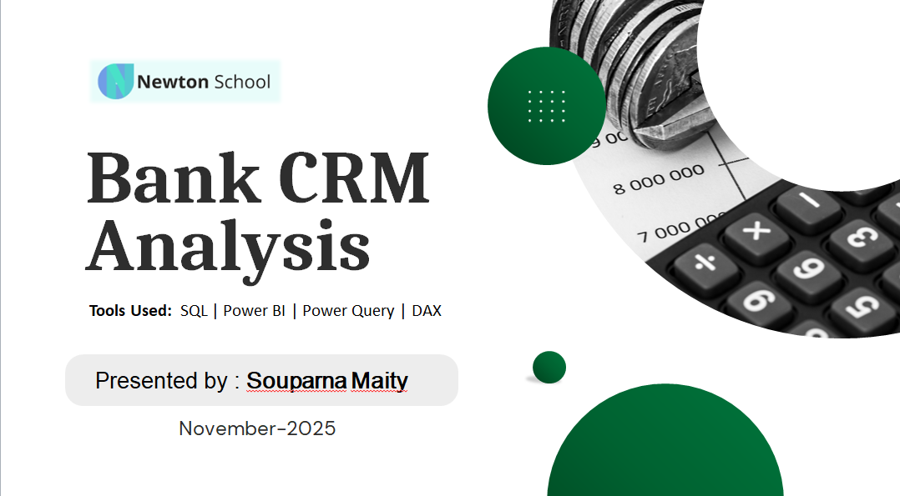

# 🏦 Banking CRM Analytics: Churn Reduction & Retention Strategy (SQL + Power BI)

## 📌 Project Summary

Designed a data-driven CRM analytics solution to identify churn drivers and build a proactive customer retention strategy for a retail bank.

Built using **SQL and Power BI**, this project transforms customer behavior data into actionable business insights.

---

## 🎯 Business Objective

- Reduce ~20% customer churn
- Identify high-risk segments
- Improve engagement through cross-selling
- Enable region-specific retention strategies

---

## 🔍 Key Insights

- Highest churn occurs within first 24 months  
- Low-to-mid credit score customers show higher exit rates  
- Inactive members are significantly more likely to churn  
- 50%+ customers hold only one product (major cross-sell opportunity)  
- Salary has weak correlation with churn; engagement metrics are stronger predictors  

---

## 📊 Dashboard Structure (6 Pages)

1. Executive Overview  
2. Churn Diagnostics  
3. Product & Engagement Analysis  
4. Geographic Performance  
5. Risk Segmentation  
6. Strategic Recommendations  

---

## 🛠 Tools & Skills Demonstrated

- SQL (segmentation, window functions, churn analysis)
- Power BI (data modeling, DAX, interactive dashboards)
- Risk analysis & customer segmentation
- Business storytelling with data
- Retention strategy design

---

## 🚀 Business Impact

✔ Identified high-risk customer segments  
✔ Designed early-tenure retention playbook  
✔ Developed cross-sell roadmap  
✔ Built region-specific churn strategy  

---

## ▶ How to Run

Open `PowerBI/BankCRM.pbix` in Power BI Desktop and refresh data if required.

---

📬 Open to roles in Data Analytics | Business Intelligence | CRM Analytics
